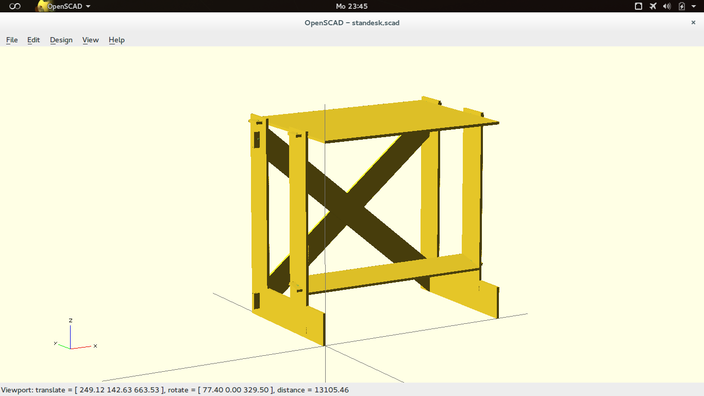
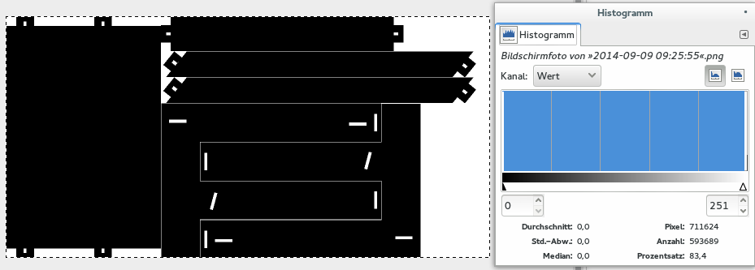

standesk
========

Let's do ourselves a favour and make a simple standing desk designed to be back-friendly, robust, cheap and easy to make. A 115 by 80cm 110cm high desk can be made out of a single 250x125cm panel using only a saw or a cnc router.

The intended material is 13mm of these brown coated birch plywood panels (in german: Sieb-Film Platte) if no one comes up with a better idea…

[Preview of the 3d model](140909.standesk-110x115x80-assembled.stl)

## Status
**in design** – there is just the idea and the openscad model so far, prototype is on the way…

### Known flaws :thumbsdown:
- Height not variable
- Right now, we only use about 84% (see the histogram screenshot) of a 2500x1250 panel when making a 1150x1100x800 desk – *how can we optimize?*
- Feet will look distinct: due to the close arrangement of the elements on the panel, the outer surface of the left foot will be the same as the inner surface of the right foot, vice versa. To solve this, one would have to mirror the first foot to create the second one. Right now, the second foot is created by rotating the first one by 180°. But how can we fit all parts on the panel then…?

### Known yeahs :thumbsup:
- Uses only wood (or other material of choice), no screws or similar
- Width, height, depth, material strenght, and many more parameters adjustable (fully parametrized scad)
- No tools needed, except for a saw or cnc mill
- Easy to source
- Cheap

### Pics




## How to build
*TODO: video*


## On the scad model
This is a first, hacky version. Needs a rewrite soon. With
- **everything much nicer AND** ;)
- a library of elements so we can easily build other furniture and stuff
- an algorithm to automagically position the elements as close as possible
- detection, if elements fit onto the panel -> warning if not

*-> basically, creating a framework for simple plug-fit furniture*

**Apart from that, you can:**
- Set your desired dimensions via the topmost variables
- Choose material width, spacings, and all the other properties…
- Switch to flat=true in order to see the individual parts arranged on the panel


## License
```
----------------------------------------------------------------------------
"PASS-IT-ON LICENSE" <3
As long as you retain this notice, you can do whatever you want with this
stuff. If you think it's worth it, pass it on and do someone else a favour.
----------------------------------------------------------------------------
```