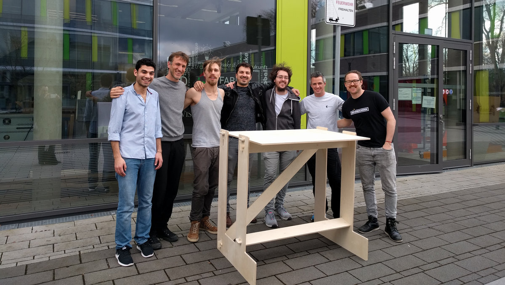
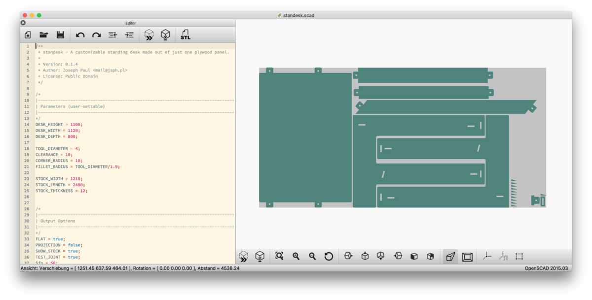
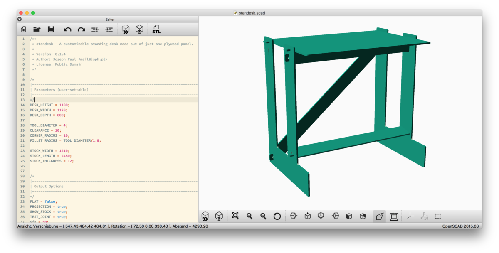

# standesk

A parametric & customizable desk, designed to be CNC-milled from a single plywood panel.

## Principles

- Only wood – no glue, screws or other fixture
- As little waste as possible – when cutting it from a single 2.50m x 1.25m sheet
- No other tools required than a 3D CNC mill and sanding paper
- Fully parametric – also adaptable to lower scales (possibly for laser cutting)

## How to build

For build instructions, please head over to my [FabAcademy page](http://archive.fabacademy.org/archives/2017/fablaberfindergarden/students/260/fabacademy/week-7/).

## On the OpenSCAD model

The model is fully parametrized, meaning that you can freely define how high, wide, and deep you want your desk to be. Yet, if you want to cut everything from one 250cm x 125cm sheet, the preset values (80x112x110) are close the maximum possible dimensions. That is, unless you find a better way to nest the parts.

Anything larger than those values will most likely require more than one panel to fabricate.

We have two basic states of the model: `FLAT = false` gives us the opportunity to get an impression of the assembled desk, while `FLAT = true` lets us produce the 2D outlines required for milling.

The tool diameter has been taken into account and can be set as a parameter. Dogbones are automatically generated accordingly and the paths are offset, so that the exported DXF traces can be directly fed into a CAM processor.

## Support / Feedback

Please use GitHub issues or Pull Requests for feedback, bug reports and improvements. If you need any further help, feel free to [contact me](mailto:mail@jsph.pl).

## License

Public Domain. Nobody cares what you do with this stuff.
